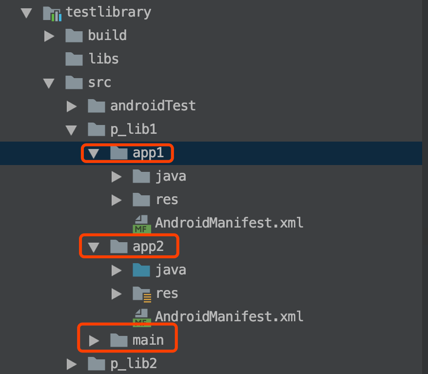

## bintray-release  [](https://bintray.com/galaxybruce/maven/pioneer-gradle-plugin/_latestVersion) [](LICENSE)
## 目前有以下功能：
* 批量上传library到本地maven或者私有maven服务器
* 处理pin工程(核心功能时合并manifest)，pin工程概念建议参考这篇文章[微信Android模块化架构重构实践](https://www.jianshu.com/p/3990724aa7e4)
* 多平台复用


## 批量上传library到本地maven或者私有maven服务器
根目录下的build.gradle中添加如下代码
```
apply plugin: 'galaxybruce-pioneer'

galaxybrucepioneer {
    // 这个字段可选，内部有默认的上传脚本
    mavenScriptPath = 'maven上传脚本文件路径'
    // 如果mavenScriptPath字段不填的话，需要填一下maven账号信息
    // =================start==================
    // 公司maven私服
    mavenUrl = 'http://test.xxx.com/nexus/content/repositories/releases'
    // 公司maven私服SnapShot
    mavenUrlSnapShot = 'http://test.xxx.com/nexus/content/repositories/snapshots'
    // maven账号
    mavenAccount = 'deployment'
    // maven密码
    mavenPwd = '666666'
    // true: maven生成到指定目录：url = project.uri(project.rootProject.projectDir.absolutePath + '/repo-local')
    localMaven = false
    // =================end==================

    // 需要批量上传到maven的library配置，具体格式可参考demo中的文件
    moduleDataPath = "${project.rootDir.path}/modulemaven.json"
}

buildscript {
    repositories {
        google()
        jcenter()
    }

    dependencies {
        classpath 'com.galaxybruce.android:pioneer-gradle-plugin:latestversion'
    }
}
```
modulemaven.json内容：
```
{
  "group": "com.galaxybruce",
  "version": "1.0.1",
  "modules": [
    {"name": "testlibrary", "artifactId": "testlibrary", "version": ""}
  ],
  "platform_modules": {
    "app1": [
      {"name": "testlibrary"}
    ],
    "app2": [
      {"name": "testlibrary"}
    ]
  }
}
```
PS: 每个library支持配置三个字段，只有name是必填字段
name: library名称
artifactId: 如果不设置，默认是project.name  
version: 如果不设置，默认是android.defaultConfig.versionName

上传maven命令：
```
    ./gradlew uploadMaven
    ./gradlew uploadMaven -PplatformFlag=app1
    ./gradlew uploadMaven -PplatformFlag=app2
```

## 处理pin工程(核心功能是合并manifest)
插件默认开启pin工程支持，在需要的pin工程module的build.gradle中添加即可，pin工程约定都已p_开头。`建议多使用pin工程，少使用module`。
```
apply plugin: 'galaxybruce-pioneer'
```
具体使用方式参考demo。

## 多平台复用
插件默认支持多平台复用，在需要开启多平台复用的module的build.gradle中添加即可。
```
apply plugin: 'galaxybruce-pioneer'
```
同时需要在根目录下的build.gradle指定当前平台资源所在目录
```
apply plugin: 'galaxybruce-pioneer'

galaxybrucepioneer {
    platformSourceDir = 'app2'
}
```

多平台项目结构



