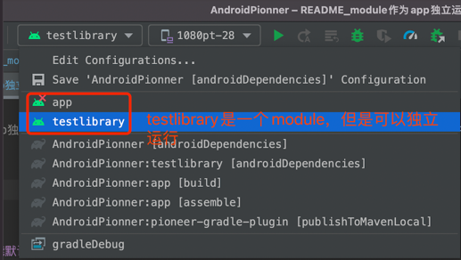
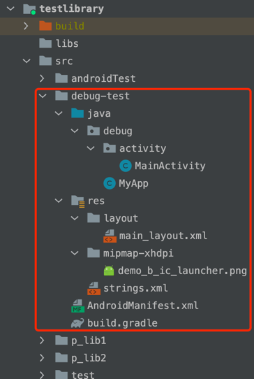

## 简介
`module作为app独立运行`是组件化开发中最基本的一个环节，适合团队规模不大，module在一个工程中的情况（团队非常大的情况，建议采用插件化的方式，每个业务独立一个工程开发）。

### 效果图


### 使用方式

#### 1. 该功能默认是关闭的，如需开启，在 local.properties 中增加 
```
RUN_AS_APP_FOR_COMPONENT=true
```

#### 2. 每个module的build.gradle最顶部添加
```
apply plugin: 'galaxybruce-pioneer'
```

#### 3. 每个module的src目录下增加 debug-test 目录
目录结果如下，参考 `testlibrary` module


每个文件作用:
* MyApp - 运行该module需要的最简初始化代码
* MainActivity - 简单的入口(一般有两个按钮，一个登录，一个进入该模块功能)
* AndroidManifest.xml - 配置MyApp以及MainActivity
* build.gradle - 增加module独立运行时需要的额外依赖 
