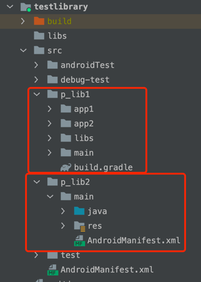

## 简介
`pin工程处理`是在一个module中把业务进一步细化成更小的工程结构。具有以下优势：
* 业务模块中进一步隔离代码和资源
* 方便实验性代码的隔离和删除
* 把相似业务作为pin工程放在一个module中，相比较作为一个module来说，编译速度更快

ps: pin工程概念建议参考这篇文章[微信Android模块化架构重构实践](https://www.jianshu.com/p/3990724aa7e4)

### 使用方式
#### 1. 插件默认开启pin工程支持，无需做任何配置 
#### 2. 在module的build.gradle中添加
```
apply plugin: 'galaxybruce-pioneer'
```
#### 3. pin工程目录约定都已p_开头，否则无法识别
* 3.1 pin工程的目录结构与普通的module结构一模一样
* 3.2 pin工程下可以设置独立的build.gradle，但是该build.gradle中不允许apply plugin: 'com.android.library'



