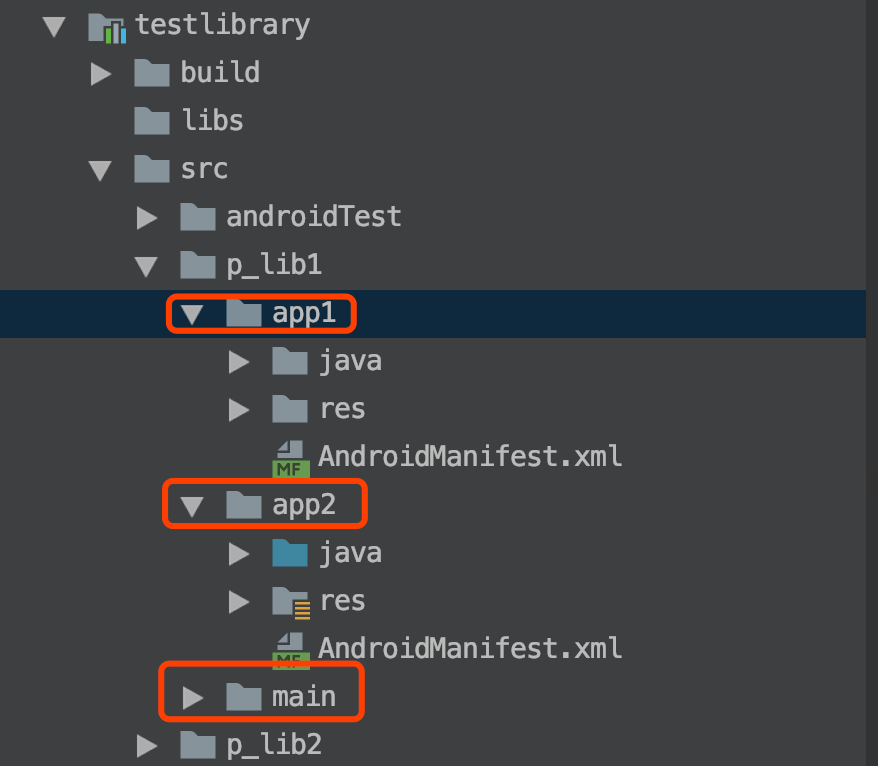

## 简介
`代码多平台复用`是指同一份代码支持差异化打包，配置不同的平台标识，运行差异化代码。

ps: 多平台复用是可以和pin工程结合使用的

### 多平台项目结构介绍


* app1目录中只存放在app1上运行有差异化的代码
* app2目录中只存放在app2上运行有差异化的代码
* main目录中就是共用部分的代码

### 使用方式
#### 1. 插件默认支持多平台复用，无需额外配置

#### 2. 在module的build.gradle中添加
```
apply plugin: 'galaxybruce-pioneer'
```

#### 3. 根目录下的build.gradle中设置插件属性时指定当前平台标识
```
apply plugin: 'galaxybruce-pioneer'

galaxybrucepioneer {
    // 该标识用来匹配代码目录
    platformSourceDir = 'app2'
    ...
}
```


